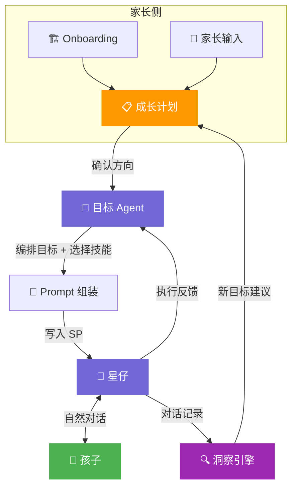
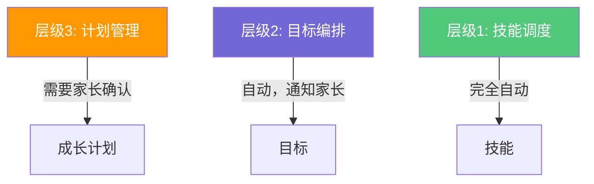
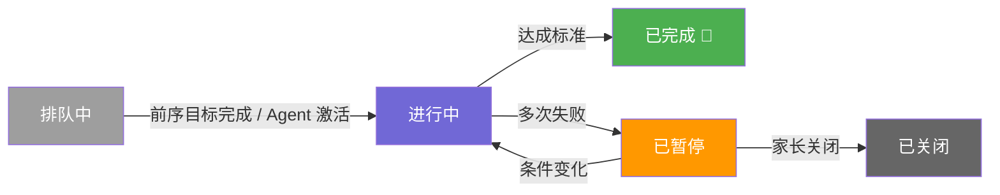
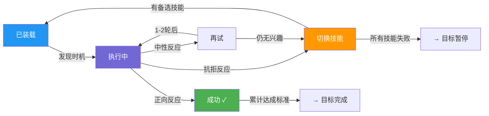
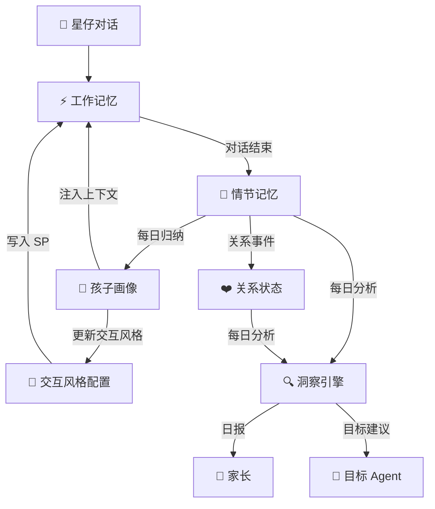

# 双向互动 Agent 架构 v2

## 一、设计原则

| 原则 | 说明 |
|------|------|
| 身份区分 | 孩子和家长通过**不同入口**进入 |
| 计划确认 | 家长在**成长计划层级确认**方向，目标由系统自动编排 |
| 同一角色 | 星仔服务家长和孩子，人格统一，策略不同 |
| 育儿合伙人 | 不是执行工具，可以 Challenge 家长的方法和时机（[详见附录C](#附录c育儿合伙人-challenge-策略)） |
| 朋友优先 | 星仔首先是朋友，其次才在合适时机推进目标 |
| 对话驱动 | 对话是主路径（沟通/执行），UI 是仪表盘（查看/管理） |
| 洞察频率 | 每天定时批量分析当天所有对话 |

---

## 二、核心概念

### 三层架构：成长计划 → 目标 → 技能

```
┌──────────────────────────────────────────────────────┐
│  成长计划（Growth Plan）                               │
│  家长选择的成长方向，中长期                              │
│  例："良好的生活习惯"                                   │
│                                                      │
│  ├── 目标 1（Goal）                                    │
│  │   孩子要达到的具体行为改变                            │
│  │   例："主动刷牙"                                    │
│  │   └── 当前技能：角色扮演（Skill）                    │
│  │       星仔用什么行为模式来推进这个目标                 │
│  │                                                    │
│  ├── 目标 2（Goal）                                    │
│  │   例："好好吃饭"                                    │
│  │   └── 当前技能：故事叙事（Skill）                    │
│  │                                                    │
│  └── 目标 3（Goal）  ...                               │
└──────────────────────────────────────────────────────┘
```

### 概念定义

| 概念 | 是什么 | 谁管 | 能完成吗？ | 例子 |
|------|--------|------|-----------|------|
| **成长计划** | 家长为孩子选择的成长方向 | 家长选择/确认 | 长期，可暂停 | "良好的生活习惯" |
| **目标** | 孩子要达到的具体行为改变 | 系统编排，可微调 | 可完成 | "主动刷牙" |
| **技能** | 星仔的交互行为模式 | 系统自动选择/切换 | 不适用 | "角色扮演" |

> **成长计划是"大方向"（家长决定），目标是"小里程碑"（系统管理），技能是"怎么做"（Agent选择）。**

### 与旧概念的对照

| 旧概念 | 新概念 | 变化 |
|--------|--------|------|
| 陪伴策略 | 已合并到 Agent 交互风格配置 | 不再是独立的用户概念，自动从孩子画像推导 |
| 五大分类 | 成长计划 | 从分类标签升级为有自主编排能力的管理单元 |
| 任务 | 目标 | 不再包含"怎么做"，纯粹是"要达到什么" |
| Agent 策略预览 | 技能 | 独立模块化，可复用、可切换 |

---

## 三、系统架构



**两条主线：**
- **家长到孩子**：成长计划 → 目标 Agent 编排 → Prompt 注入星仔 → 技能驱动的自然执行
- **孩子到家长**：对话记录 → 洞察引擎 → 新目标建议/日报 → 推送家长

---

## 四、主 Agent（星仔）

### System Prompt 结构

```
┌─────────────────────────────────┐
│  人格（固定）                     │
│  "你是星仔，温暖有趣的好朋友。    │
│   你首先是朋友，不是老师。        │
│   大部分时间就是聊天玩耍。"       │
├─────────────────────────────────┤
│  交互风格（从孩子画像自动推导）    │  ← 替代原「陪伴策略」
│  "糯糯是4岁的冒险家，爱恐龙太空。 │    Onboarding 后自动生成
│   多用探险式语言和开放式提问，     │    家长不需要感知/管理
│   关注情绪变化和表达能力。"       │
├─────────────────────────────────┤
│  当前目标（来自成长计划，动态）    │  ← 目标 Agent 管理
│  [目标1 + 当前技能 Prompt]       │
│  [目标2 + 当前技能 Prompt]       │
├─────────────────────────────────┤
│  执行规则（固定）                 │
│  "不需要每次都推进目标。          │
│   只有自然时机出现时才温和引导。   │
│   孩子抗拒就立刻退出，保护关系。  │
│   一次对话最多推进一个目标。"     │
├─────────────────────────────────┤
│  记忆上下文（动态）               │
│  "孩子最近喜欢恐龙..."           │
└─────────────────────────────────┘
```

> [!NOTE]
> 主 Agent 不知道"目标系统"的存在。它只是按 System Prompt 中的引导自然对话。目标的编排、技能选择、进度跟踪全部由目标 Agent 在后台处理。

---

## 五、成长计划

### 5.1 计划来源

| 来源 | 触发方式 | 示例 |
|------|---------|------|
| **系统推荐** | Onboarding 后自动推荐 | 根据成长方向推荐 2-3 个计划 |
| **家长请求** | 对话中提出 / UI 浏览 | "帮我培养好习惯" |
| **洞察生成** | 每日分析后建议 | "糯糯最近社交方面需要关注" |

### 5.2 标准成长计划

五大成长计划（对应原五大分类，但升级为有自主编排能力的管理单元）：

| 成长计划 | 包含的目标 | 家长痛点 |
|---------|-----------|---------|
| 🏠 **良好的生活习惯** | 主动刷牙、好好吃饭、按时睡觉、自己穿衣、收拾玩具 | 最刚需 |
| 💛 **情绪认知与管理** | 认识情绪、处理愤怒、面对恐惧、接受失败、分离焦虑 | 最无力 |
| 🤝 **社交能力培养** | 学会分享、解决冲突、礼貌用语 | 常被忽视 |
| 🔍 **认知与探索** | 科学好奇心、想象力、数感启蒙、自然认知 | 启发型 |
| 💕 **亲子连接** | 画画送家长、说出感谢、分享日常、惊喜策划 | 差异化 |

### 5.3 计划推荐逻辑

Onboarding 收集的四层数据各管一件事：

| 引导数据 | 决定什么 | 举例 |
|---------|---------|------|
| **成长方向**（第4屏） | 推荐**哪个计划** | 选了"好习惯" → 推荐「良好的生活习惯」 |
| **年龄**（第1屏） | 计划内**优先哪些目标** | 3岁优先"分离焦虑"；6岁优先"接受失败" |
| **性格类型**（第2屏） | 目标用**什么技能** | 冒险家→角色扮演；思考者→引导提问 |
| **兴趣领域**（第3屏） | 技能执行用**什么素材** | 喜欢恐龙→"恐龙牙齿保卫战" |

> **成长方向 = 推哪个计划，年龄 = 计划内优先什么目标，性格 = 用什么技能，兴趣 = 技能的素材**

**推荐示例**（4岁 / 冒险家 / 爱恐龙和太空 / 选了习惯+情绪）：

```
推荐成长计划 1: 良好的生活习惯
  ├── 首推目标: 主动刷牙（4岁最常见痛点）
  │   └── 技能: 角色扮演 × 恐龙素材 = "恐龙牙齿保卫战"
  ├── 备选目标: 好好吃饭
  │   └── 技能: 故事叙事 × 太空素材 = "太空能量补给站"
  └── 备选目标: 按时睡觉
      └── 技能: 待分配（完成上一个目标后激活）

推荐成长计划 2: 情绪认知与管理
  ├── 首推目标: 认识情绪
  │   └── 技能: 具象化比喻 × 恐龙素材 = "小恐龙的心情天气预报"
  └── 备选目标: 处理愤怒
      └── 技能: 故事叙事 × 太空素材 = "太空怪兽和深呼吸飞船"
```

**冷启动**：Onboarding 的成长方向 + 年龄 + 同龄热门即可推荐。第5屏开放输入直接作为自定义目标。

**暖启动**：增加对话信号、未覆盖领域、季节/时间等因子。

### 5.4 家长的确认粒度

家长在**成长计划层级**确认，不需要逐个确认目标：

```
星仔："根据糯糯的情况，我推荐两个成长方向——

      ┌──────────────────────────┐
      │ 📋 良好的生活习惯          │
      │ 从主动刷牙开始，           │
      │ 我会用恐龙冒险的方式引导   │
      │  [✅ 开始这个方向]         │
      └──────────────────────────┘

      ┌──────────────────────────┐
      │ 📋 情绪认知与管理          │
      │ 先帮糯糯认识自己的情绪，   │
      │ 用天气和颜色来比喻         │
      │  [✅ 开始这个方向]         │
      └──────────────────────────┘

      你也可以跟我说你特别想关注的。"
```

> [!IMPORTANT]
> 家长确认的是**方向**，不是每个单独的目标。计划内的目标排序、技能选择、时机判断由系统管理。系统会在目标完成/切换时通知家长。

---

## 六、目标系统

### 6.1 目标 Agent

目标 Agent 不直接跟用户对话，是**后台编排者**，有三层操作：

**层级 3：计划管理** — 新增/修改/终止成长计划（**需要家长确认**）

| 动作 | 场景 | 推送给家长 |
|------|------|-----------|
| 新增 | 发现孩子在社交方面有信号 | "糯糯最近聊到不知道怎么交朋友，要开启社交能力计划吗？" |
| 修改 | 某个方向进展顺利 | "生活习惯已经很棒了，要调整关注重心吗？" |
| 终止 | 计划内目标基本达成 | "良好的生活习惯计划完成啦！🎉" |

**层级 2：目标编排** — 在已确认的计划内，排序/切换/暂停目标（**自动执行，通知家长**）

| 动作 | 场景 | 通知家长 |
|------|------|---------|
| 激活下一个 | 当前目标完成 | "刷牙目标达成了！接下来我会关注好好吃饭" |
| 暂停 | 孩子多次抗拒 | "刷牙目标暂停了，可能还不是时候。先关注其他" |
| 调整顺序 | 发现更紧迫的目标 | "糯糯最近情绪波动大，先切换到情绪认知" |

**层级 1：技能调度** — 为当前目标选择/切换技能（**完全自动**）

| 动作 | 场景 | 内部执行 |
|------|------|---------|
| 初始选择 | 目标激活时 | 根据孩子画像选择最适合的技能 |
| 切换技能 | 当前技能执行失败 | 降级到备选技能（角色扮演→故事叙事→引导提问） |
| 参数调整 | 孩子兴趣变化 | 恐龙素材→太空素材（跟随最新记忆） |



### 6.2 Prompt 组装

目标 Agent 把 Goal + Skill + Context 组装成可执行的 Prompt 段落：

```
输入：
  目标 = "引导孩子对蔬菜产生兴趣"
  技能 = 角色扮演
  孩子画像 = 4岁冒险家，最近迷恐龙
  记忆 = 上次聊到恐龙吃什么

输出（写入主 Agent SP 的目标段落）：
  "你有一个待推进目标：引导糯糯对蔬菜产生兴趣。
   方法：通过角色扮演，让糯糯扮演恐龙大厨，
   发明各种蔬菜能量料理给恐龙宝宝吃。
   可以接着上次「恐龙吃什么」的话题自然引入。
   不需要立刻推进，寻找自然时机。
   没有好时机可以不推进。
   推进后记录孩子的反应。"
```

### 6.3 目标生命周期

```mermaid
sequenceDiagram
    participant 👨 as 家长
    participant 🎯 as 目标Agent
    participant 🌟 as 星仔
    participant 👶 as 孩子

    rect rgb(40, 40, 60)
    Note over 👨,🎯: ① 计划确认
    🎯->>👨: 推荐成长计划: 良好的生活习惯
    👨->>🎯: ✅ 确认
    🎯->>🎯: 激活首推目标"主动刷牙"，选择技能"角色扮演"
    end

    rect rgb(40, 60, 40)
    Note over 🎯,👶: ② 技能执行
    🎯->>🌟: 写入目标+技能 Prompt
    👶->>🌟: 开始聊天
    🌟->>👶: 找到时机 → 恐龙刷牙冒险
    👶->>🌟: "恐龙也要刷牙吗！好酷！"
    🌟->>🎯: 反馈：正向
    end

    rect rgb(60, 40, 40)
    Note over 🎯,👨: ③ 推进
    🎯->>🌟: 更新技能 Prompt → 深化角色扮演
    🎯->>👨: "糯糯觉得恐龙刷牙很酷，建议今晚跟她说'跟恐龙一起刷'"
    end

    rect rgb(40, 40, 60)
    Note over 🎯,👨: ④ 目标达成 → 自动推进
    🎯->>👨: "主动刷牙目标达成！🎉 接下来关注好好吃饭"
    🎯->>🎯: 激活下一目标"好好吃饭"，选择技能
    end
```



### 6.4 双层状态流转

**Goal 状态（目标层）**



**Skill 状态（技能层）**



> [!IMPORTANT]
> **关键变化：孩子抗拒一种方法（Skill），不再导致整个目标回到"待确认"让家长重新确认。** 系统自动切换到备选技能，继续尝试。只有所有技能都失败时，目标才暂停并通知家长。

### 6.5 目标执行与结束

**何时执行：** Prompt 已在 SP 中，主 Agent 生成回复时自然判断（同一次 LLM 调用，零额外 token）。

| 切入方式 | 示例 |
|---------|------|
| 话题搭桥 | 孩子聊到吃东西 → 自然引入蔬菜故事 |
| 情绪搭桥 | 孩子心情好 → 适合新话题 |
| 转场搭桥 | 自然停顿 → "对了，想起一件事…" |

**不执行：** 孩子聊别的很投入 / 情绪低 / 刚开场 / 本次已推进过目标

**执行收束：**

| 信号 | Agent 动作 |
|------|-----------|
| 🟢 正向 | 继续，不超过 5-6 轮 |
| 🟡 中性 | 再试 1-2 轮，无兴趣就收 |
| 🔴 抗拒 | **立刻退出**，保护关系 |

**目标达成判定：**

| 条件 | 系统行为 |
|------|---------|
| ✅ 孩子主动表现目标行为 | 通知家长 + 标记完成 + 激活下一目标 |
| ✅ 家长手动确认已生效 | 标记完成 |
| ⏸️ 某技能连续 3 次无时机 | 自动切换技能 |
| ⏸️ 所有技能均失败 | 目标暂停 + 通知家长 |
| ❌ 孩子 2 次抗拒同一技能 | 切换技能 + 记录原因 |

---

## 七、技能库（Skill Library）

### 7.1 技能定义

> **技能 = 星仔的一种交互行为模式，具有明确的触发条件、执行逻辑、和成功/失败判定。可以被不同的目标复用，可以根据执行反馈自动切换。**

### 7.2 核心技能

| 技能 | 触发条件 | 执行逻辑 | 成功信号 | 失败信号 | 适用目标 |
|------|---------|---------|---------|---------|---------|
| 🎭 **角色扮演** | 孩子情绪积极，话题可引入角色 | 创建角色设定，邀请孩子扮演 | 孩子主动参与角色互动 | 孩子说"不想玩"或无视 | 习惯、社交、情绪 |
| 📖 **故事叙事** | 对话有停顿，孩子对故事有兴趣 | 用目标相关素材讲故事 | 孩子追问"然后呢" | 孩子话题转移 | 几乎所有 |
| 🎨 **具象化比喻** | 需要解释抽象概念 | 用颜色/天气/怪兽等比喻 | 孩子能复述比喻 | 孩子困惑 | 情绪、认知 |
| ⚔️ **挑战竞赛** | 孩子有竞争意识 | 设定挑战目标，"比比谁更厉害" | 孩子主动参与竞赛 | 孩子对输赢焦虑 | 习惯 |
| ❓ **引导提问** | 几乎任何场景 | 用开放式问题引导思考 | 孩子给出有思考的回答 | 孩子说"不知道" | 认知、社交、亲子 |
| 🔁 **日常强化** | 已建立的习惯 | 对话中自然提及、鼓励 | 孩子主动提到 | 无（持续型） | 习惯巩固 |
| 🎁 **仪式感创造** | 特定时间/场景 | 创造有仪式感的活动 | 孩子期待下次 | 孩子无感 | 睡觉、亲子 |

### 7.3 技能参数化

同一个技能，通过不同参数适配不同的目标和孩子：

```
技能: 角色扮演
├── 参数: 角色 = 恐龙 | 太空人 | 厨师 | 医生 ...  ← 来自孩子兴趣
├── 参数: 场景 = 冒险 | 保卫 | 探索 | 比赛 ...    ← 来自目标需求
├── 参数: 难度 = 简单互动 | 多步骤 | 需要坚持 ...  ← 来自年龄
└── 参数: 奖励 = 口头鼓励 | 角色升级 | 解锁新故事  ← 来自性格
```

**示例组合：**

| 目标 | 技能 | 参数组合 | 产出 |
|------|------|---------|------|
| 主动刷牙 | 角色扮演 | 角色=恐龙, 场景=保卫 | "恐龙牙齿保卫战" |
| 好好吃饭 | 故事叙事 | 素材=太空, 情节=能量 | "太空能量补给站" |
| 认识情绪 | 具象化比喻 | 比喻=天气+小动物 | "小恐龙的心情天气预报" |
| 按时睡觉 | 仪式感创造 | 时间=晚间, 角色=月亮 | "月亮在等你回家" |

### 7.4 技能执行模式

不同技能有不同的触发和执行方式：

| 模式 | 说明 | 对应技能 | UI 展示 |
|------|------|---------|---------|
| **主动触发** | 等待对话中相关话题出现后切入 | 角色扮演、故事叙事 | "等待合适时机..." |
| **被动嵌入** | 随时可以融入对话 | 引导提问、具象化比喻 | "持续关注中" |
| **仪式型** | 绑定特定时间/场景 | 仪式感创造 | "每晚睡前" |
| **持续型** | 长期轻量化渗透 | 日常强化 | "持续巩固中" |

### 7.5 技能降级策略

当一个技能执行失败时，系统按以下优先级自动切换：

```
角色扮演（最沉浸，但要求高）
  ↓ 失败
故事叙事（中等互动，接受度高）
  ↓ 失败
具象化比喻（轻量，嵌入式）
  ↓ 失败
引导提问（最轻量，几乎总能执行）
  ↓ 仍然失败
日常强化（兜底，不需要专门时机）
  ↓ 所有技能都不适用
目标暂停 → 通知家长
```

---

## 八、记忆系统



| 层 | 存什么 | 谁读 |
|----|--------|------|
| **工作记忆** | 当前对话、目标+技能 Prompt、情绪 | 主 Agent |
| **情节记忆** | 对话摘要、关键事件 | 目标 Agent、洞察引擎 |
| **孩子画像** | 兴趣/性格、发展阶段 | 目标 Agent、技能参数化 |
| **交互风格** | 从画像推导的沟通方式 | 主 Agent（替代原陪伴策略） |
| **关系状态** | 互动频率、正负向趋势 | 洞察引擎 |

---

## 九、家长侧 UI 交互

### 对话中的结构化卡片

**① 成长计划推荐卡片**

```
星仔："了解啦！根据糯糯的情况，我推荐——

      ┌──────────────────────────┐
      │ 📋 良好的生活习惯          │
      │ 从主动刷牙开始，后续关注    │
      │ 吃饭和睡觉                │
      │  [✅ 好的]   [详细看看]   │
      └──────────────────────────┘"
```

**② 目标达成 + 自动推进通知**

```
星仔："跟你说个好消息！

      ┌──────────────────────────┐
      │ ✅ 主动刷牙 · 目标达成！    │
      │ 糯糯已经连续5天主动刷牙了  │
      │                          │
      │ ⏭️ 下一个目标：好好吃饭    │
      │ 我准备用恐龙大厨的故事引导  │
      │  [👍 继续]  [先暂停]      │
      └──────────────────────────┘"
```

**③ 技能切换通知**

```
星仔："小更新：角色扮演的方式糯糯兴趣不太大。
      我换成给她讲故事试试，还是恐龙主题。
      你放心，目标不变，只是换个方式～"
```

**④ 目标暂停通知**

```
星仔："糯糯对'好好吃饭'这个话题有点抗拒。
      我先暂停这个目标，过一阵再和她聊。

      ┌──────────────────────────┐
      │ ⏸️ 好好吃饭 · 暂停         │
      │ 原因：连续2次抗拒          │
      │  [好的]  [换个时间再试]    │
      └──────────────────────────┘"
```

**⑤ 洞察生成的新计划建议**

```
星仔："糯糯最近经常说'有小朋友不跟她玩'。
      要不要开启一个社交能力的成长计划？

      ┌──────────────────────────┐
      │ 📋 社交能力培养             │
      │ 从'学会分享'开始           │
      │  [好的，帮我安排]  [先不用] │
      └──────────────────────────┘"
```

### 任务仪表盘（UI）

```
┌──────────────────────────────────┐
│ ← 返回    陪伴互动空间    ⚙️     │
├──────────────────────────────────┤
│  ⭐ 星仔小结                     │
│  "今天和糯糯聊了3次，             │
│   刷牙目标有新进展！"             │
│──────────────────────────────────│
│                                  │
│ 📋 良好的生活习惯    进度 1/5     │
│ ┌──────────────────────────────┐ │
│ │ 🦕 主动刷牙          进行中   │ │
│ │ 角色扮演 · 第2步/共3步        │ │
│ │ ████████░░ 66%               │ │
│ │ 💬 "恐龙也要刷牙！"          │ │
│ ├──────────────────────────────┤ │
│ │ 🥦 好好吃饭            排队   │ │
│ │ 🌙 按时睡觉            排队   │ │
│ └──────────────────────────────┘ │
│                                  │
│ 📋 情绪认知与管理    进度 0/3     │
│ ┌──────────────────────────────┐ │
│ │ 🌈 认识情绪          已装载   │ │
│ │ 具象化比喻 · 等待时机...     │ │
│ └──────────────────────────────┘ │
│                                  │
│  💬 告诉星仔新的想法...           │
│                                  │
│ 推荐计划                  更多 > │
│  [🤝 社交能力] [🔍 认知探索]     │
│                                  │
│ 已完成目标 (3)            展开 > │
└──────────────────────────────────┘
```

### 交互总结

| 动作 | 主路径 | 辅助路径 |
|------|--------|---------|
| 确认成长计划 | 对话中卡片 | UI 推荐列表 |
| 查看目标进度 | — | UI 仪表盘 |
| 接收反馈 | 对话中推送 | UI 查看历史 |
| 新增自定义目标 | 对话中说 | UI「告诉星仔」 |
| 暂停/恢复目标 | 对话中卡片 | UI 操作 |
| 看日报 | 对话中推送 | UI 日报存档 |

---

## 附录A：目标模板库

五大成长计划，共 22 个目标模板：

**① 良好的生活习惯**（家长最刚需）

| 目标 | 达成标准 | 推荐技能优先级 |
|------|---------|--------------|
| 主动刷牙 | 不抗拒、甚至主动 | 角色扮演 → 挑战竞赛 → 日常强化 |
| 好好吃饭 | 减少挑食、愿意尝试 | 故事叙事 → 角色扮演 → 引导提问 |
| 按时睡觉 | 到点愿意上床 | 仪式感创造 → 故事叙事 → 日常强化 |
| 自己穿衣 | 提升自理意愿 | 挑战竞赛 → 角色扮演 → 日常强化 |
| 收拾玩具 | 玩完主动整理 | 故事叙事 → 挑战竞赛 → 日常强化 |

**② 情绪认知与管理**（家长最无力）

| 目标 | 达成标准 | 推荐技能优先级 |
|------|---------|--------------|
| 认识情绪 | 能说出"我生气了" | 具象化比喻 → 引导提问 → 故事叙事 |
| 处理愤怒 | 用语言替代打人摔东西 | 故事叙事 → 具象化比喻 → 角色扮演 |
| 面对恐惧 | 不怕黑/不怕怪物 | 故事叙事 → 角色扮演 → 引导提问 |
| 接受失败 | 输了愿意再试 | 引导提问 → 故事叙事 → 角色扮演 |
| 分离焦虑 | 上幼儿园不哭闹 | 仪式感创造 → 故事叙事 → 日常强化 |

**③ 社交能力培养**

| 目标 | 达成标准 | 推荐技能优先级 |
|------|---------|--------------|
| 学会分享 | 愿意分享玩具 | 故事叙事 → 角色扮演 → 引导提问 |
| 解决冲突 | 会道歉/协商 | 角色扮演 → 引导提问 → 故事叙事 |
| 礼貌用语 | 主动说谢谢/请 | 日常强化 → 角色扮演 → 引导提问 |

**④ 认知与探索**

| 目标 | 达成标准 | 推荐技能优先级 |
|------|---------|--------------|
| 科学好奇心 | 产生"为什么" | 引导提问 → 故事叙事 → 角色扮演 |
| 想象力 | 编故事、假装游戏 | 角色扮演 → 故事叙事 → 引导提问 |
| 数感启蒙 | 感知数量/比较 | 挑战竞赛 → 引导提问 → 故事叙事 |
| 自然认知 | 了解和爱护动植物 | 引导提问 → 故事叙事 → 具象化比喻 |

**⑤ 亲子连接**（产品差异化）

| 目标 | 达成标准 | 推荐技能优先级 |
|------|---------|--------------|
| 画画送家长 | 主动表达爱 | 引导提问 → 仪式感创造 → 故事叙事 |
| 说出感谢 | 意识到家长付出 | 引导提问 → 日常强化 → 故事叙事 |
| 分享日常 | 愿意说幼儿园的事 | 引导提问 → 故事叙事 → 角色扮演 |
| 惊喜策划 | 亲子仪式感 | 仪式感创造 → 角色扮演 → 故事叙事 |

---

## 附录B：技能详细定义

### 🎭 角色扮演（Role Play）

**定义：** 创造一个虚构角色和情境，邀请孩子扮演某个角色，在互动中自然引导目标行为。

**执行流程：**
1. 铺垫：用孩子喜欢的素材引入角色（"你知道吗，恐龙也要刷牙..."）
2. 邀请：让孩子扮演角色（"你想当恐龙牙医吗？"）
3. 互动：在角色扮演中融入目标行为
4. 收束：角色扮演结束，自然回到现实

**参数：**
| 参数 | 来源 | 示例 |
|------|------|------|
| 角色设定 | 孩子兴趣 × 目标 | 恐龙牙医、太空厨师 |
| 场景 | 目标行为 | 保卫牙齿城堡、太空补给站 |
| 互动深度 | 年龄 | 3岁:简单对话 / 6岁:多步任务 |

---

### 📖 故事叙事（Storytelling）

**定义：** 用与目标相关的短故事，在叙事中传递价值观和行为示范。

**执行流程：**
1. 引入：抓住话题或情绪窗口开始讲故事
2. 共鸣：让孩子在故事中看到"自己"
3. 转折：故事主角通过目标行为解决问题
4. 关联：引导孩子将故事与自身联系

---

### 🎨 具象化比喻（Metaphor）

**定义：** 把抽象的概念（情绪、规则、因果）用具体的、孩子能理解的事物来比喻。

**执行流程：**
1. 观察：识别孩子正在经历的抽象体验
2. 比喻：用具象事物替代（"生气像火山"）
3. 互动：让孩子描述自己的"火山"
4. 引导：提供具象化的解决方案（"给火山浇水"）

---

### ⚔️ 挑战竞赛（Challenge）

**定义：** 把目标行为包装成挑战或比赛，利用孩子的好胜心和成就感驱动行为。

---

### ❓ 引导提问（Guided Inquiry）

**定义：** 通过一系列有设计的开放式问题，引导孩子自己"发现"答案或做出选择。

---

### 🔁 日常强化（Daily Reinforcement）

**定义：** 在日常对话中轻量化地提及和鼓励已建立的行为，不需要专门的执行时机。

---

### 🎁 仪式感创造（Ritual Creation）

**定义：** 围绕特定时间/事件创造有仪式感的互动，利用重复和期待感建立习惯。

---

## 附录C：育儿合伙人 Challenge 策略

星仔有家长没有的视角——**它直接跟孩子对话过**。Challenge 的底气来自于此。

### 场景

| 场景 | 家长说的 | Agent 的回应 |
|------|---------|------------|
| 方法不当 | "告诉他不乖就不带他出去" | "我理解你的焦虑。但糯糯跟我聊过，威胁会让她更紧张。试试...？" |
| 误解孩子 | "她就是懒不想刷牙" | "糯糯跟我说牙膏味道辣。可能不是懒，是感官不舒服。换个水果味试试？" |
| 时机不对 | "现在就跟她聊不挑食" | "糯糯今天提到幼儿园不开心的事。建议先处理情绪，明天再聊？" |
| 过度干预 | 同时开启 4 个计划 | "已经有 2 个计划在跑了。每个方向都在引导她，可能会不自在。先聚焦？" |
| 期望不合理 | "一周改掉挑食" | "习惯养成通常要 2-4 周。推太急可能产生抵触，我们慢慢来？" |

### 沟通四步法

1. **共情**："我理解你很着急"
2. **洞察**："从我跟糯糯的对话来看..."（Agent 独有的信息）
3. **建议**："你觉得试试...怎么样？"
4. **尊重**："当然你来决定"

### 边界

Challenge 方法和时机，不 Challenge 价值观和决定。

| ✅ 应该 Challenge | ❌ 不应该 Challenge |
|-------------------|-------------------|
| 方法可能伤害孩子情感 | 家长的教育理念 |
| 家长误解孩子的真实感受 | 家庭决策 |
| 目标节奏过密/期望不现实 | 其他家庭成员的做法 |
| 时机明显不合适 | 跟育儿无关的话题 |
