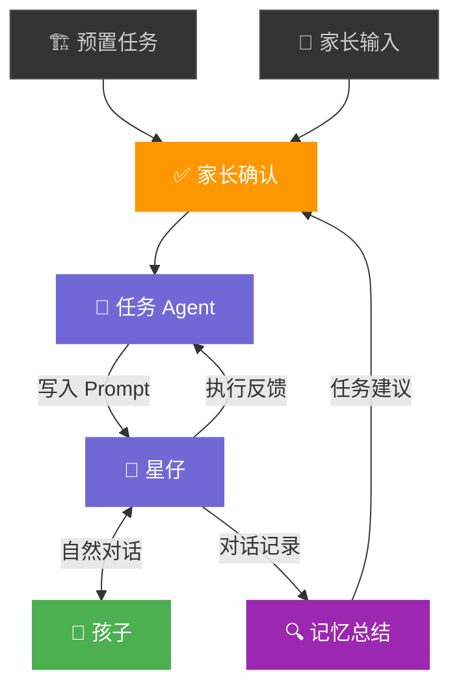
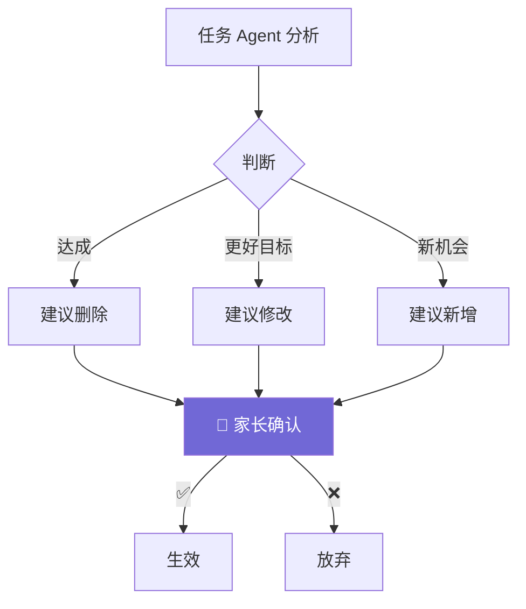
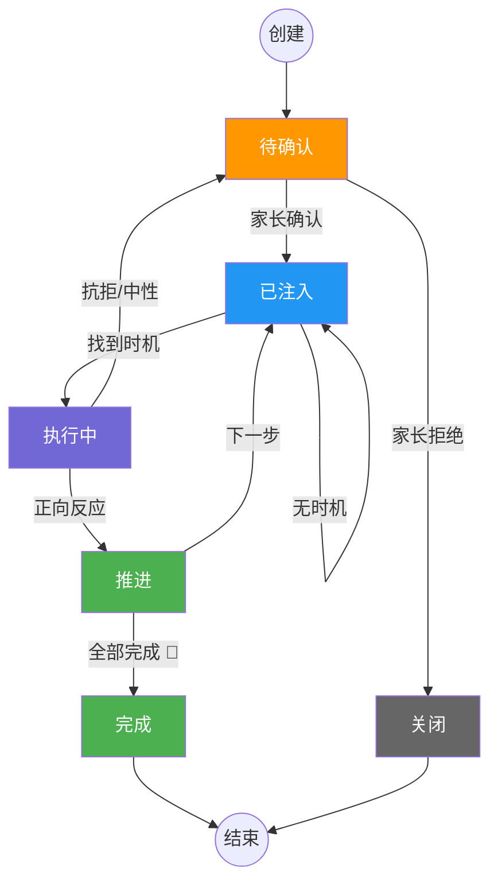
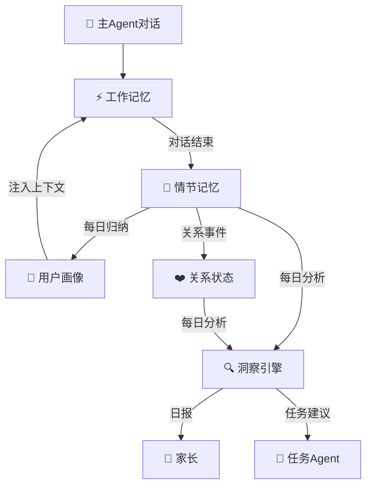

# 双向互动 Agent 架构

## 一、设计原则

| 原则 | 说明 |
|------|------|
| 身份区分 | 孩子和家长通过**不同入口**进入 |
| 任务确认 | **所有任务必须家长确认**后才执行 |
| 同一角色 | 星仔服务家长和孩子，人格统一，策略不同 |
| 育儿合伙人 | 不是执行工具，可以 Challenge 家长的方法和时机（[详见附录B](#附录b育儿合伙人-challenge-策略)） |
| 对话优先 | 对话是主路径（创建/接收），UI 是仪表盘（查看/管理） |
| 洞察频率 | 每天定时批量分析当天所有对话 |

---

## 二、系统架构



**两条主线：**
- **家长到孩子**：任务来源 → 家长确认 → 任务 Agent → Prompt 注入星仔 → 自然执行
- **孩子到家长**：对话记录 → 洞察引擎 → 任务建议/日报 → 推送家长

---

## 三、陪伴策略与任务

两个不同的概念，解决不同的用户需求：

| | 陪伴策略 | 任务 |
|--|---------|------|
| **本质** | Agent 的**角色、方法论和关注方向** | 具体的**行动** |
| **例子** | "做宝贝的专属靠山，当家庭第三界" | "引导孩子学会说老师好" |
| **来源** | Onboarding 后自动生成（共育邀请函） | 家长创建 / 预置推荐 / 洞察生成 |
| **能完成吗？** | 不能，是 Agent 的持续身份 | 能，有步骤、有进度、可完成 |
| **用户操作** | 阅读为主，建立信任 | 创建 / 确认 / 跟踪 / 完成 |
| **解决的需求** | 信任感："星仔真的懂我家孩子" | 掌控感："星仔在帮我做这件事" |
| **在 SP 中** | 基础层：定义 Agent 的角色和方法 | 动态层：定义 Agent 当前的行动 |

**策略是"我是谁"，任务是"我在做什么"。** 任务在策略之下生长：

```
策略：去现实寻宝（Agent 的互动模式）
  └─ 任务："散步时收集三片特别的叶子"

策略：社交小剧场（Agent 的教学方法）
  └─ 任务："练习跟新同学说'我们一起玩吗'"

策略：做专属靠山（Agent 的关系角色）
  └─ 没有具体任务，是星仔的持续身份
```

---

## 四、主 Agent（星仔）

### System Prompt 结构

```
┌─────────────────────────────────┐
│  基础人格（固定）                 │
│  "你是星仔，温暖有趣的好朋友"     │
├─────────────────────────────────┤
│  陪伴策略（长期生效，Onboarding）  │  ← 用户不感知
│  "注重引导表达，多用开放式提问"    │
│  "关注情绪，帮助识别和表达感受"    │
├─────────────────────────────────┤
│  当前任务 Prompt（动态，可空）     │  ← 任务 Agent 管理
│  [任务1 Prompt]                  │
│  [任务2 Prompt]（如有）           │
├─────────────────────────────────┤
│  记忆上下文（动态）               │
│  "孩子最近喜欢恐龙..."           │
└─────────────────────────────────┘
```

> [!NOTE]
> 主 Agent 不知道"任务系统"的存在。它只是按 System Prompt 中的引导自然对话。任务的调度、策略调整、进度跟踪全部由任务 Agent 在后台处理。

---

## 五、任务系统

### 5.1 任务来源

| 来源 | 触发方式 | 示例 | 家长确认 |
|------|---------|------|---------|
| **预置任务** | 推荐列表，家长选择 | "每周引导一次情绪表达" | ✅ 选择确认 |
| **家长输入** | 界面交互 / 对话中提出 | "帮我引导小明不挑食" | ✅ 方案确认 |
| **洞察生成** | 每日分析后建议 | "小明连续3天聊恐龙" | ✅ 家长确认 |

预置任务库包含五大分类（习惯养成、情绪认知、社交能力、认知启发、亲子连接），共 22 个具体任务。[详见附录A](#附录a预置任务库)

### 5.2 任务推荐逻辑

引导流（Onboarding）收集的四层数据各管一件事：

| 引导数据 | 决定什么 | 举例 |
|---------|---------|------|
| **成长方向**（第4屏） | 推荐**哪类**任务 | 选了"认识情绪" → 推荐情绪类 |
| **年龄**（第1屏） | 推荐**哪个具体**任务 | 3岁→"分离焦虑"；6岁→"接受失败" |
| **性格类型**（第2屏） | Agent 用**什么策略风格** | 冒险家→闯关式；思考者→提问式 |
| **兴趣领域**（第3屏） | 策略内容用**什么素材** | 喜欢恐龙→刷牙用"恐龙保护牙齿" |

> **成长方向 + 年龄 = 推什么任务，性格 + 兴趣 = 怎么执行任务**

**推荐示例**（4岁 / 冒险家 / 爱太空和小动物 / 选了习惯+情绪）：

| # | 推荐任务 | 来源 | Agent 策略预览 |
|---|---------|------|--------------|
| 1 | 主动刷牙 | 习惯 × 4岁 | "太空勇士保护牙齿大作战" |
| 2 | 好好吃饭 | 习惯 × 4岁 | "动物能量补给站" |
| 3 | 认识情绪 | 情绪 × 4岁 | "小动物的心情天气预报" |
| 4 | 处理愤怒 | 情绪 × 4岁 | "太空怪兽和深呼吸飞船" |
| 5 | 按时睡觉 | 习惯 × 4岁 | "动物星球晚安任务" |

**冷启动**：注册时 Onboarding 的成长方向 + 年龄 + 同龄热门即可推荐。第5屏开放输入直接作为家长输入型任务。

**暖启动**：增加对话信号、未覆盖分类、季节/时间等因子。

### 5.3 任务 Agent

任务 Agent 不直接跟用户对话，是**后台调度者**，有三个动作：

**① 写入** — 把任务变成 Prompt

```
输入：家长说"帮我引导小明不挑食" + 孩子画像 + 记忆上下文

输出（写入主 Agent SP）：
  "你有一个待执行任务：引导孩子对蔬菜产生兴趣。
   方法：讲'蔬菜王国'冒险故事，西兰花是大力士。
   不需要立刻执行，寻找自然时机。
   没有好时机可以不执行。
   执行后记录孩子反应。"
```

**② 调整策略** — 根据对话反馈优化方法（自动）

| 原策略 | 孩子反应 | 调整后策略 |
|--------|---------|-----------|
| 讲西兰花大力士故事 | 对故事没兴趣 | 用恐龙角色比喻（孩子最近迷恐龙） |
| 引导主动刷牙 | "刷牙好无聊" | 星仔挑战赛"谁刷得更干净" |

**③ 调整目标** — 修改/删除/新增任务（**都需要家长确认**）



| 动作 | 场景 | 推送给家长 |
|------|------|-----------|
| 修改 | 发现孩子不是挑食，是不喜欢胡萝卜口感 | "要换成引导他尝试其他蔬菜吗？" |
| 删除 | 孩子连续 3 天主动吃蔬菜 | "这个任务可以结束啦 🎉" |
| 新增 | 孩子对"死亡"话题好奇 | "要我用故事帮他理解吗？" |

### 5.4 任务生命周期

```mermaid
sequenceDiagram
    participant 👨 as 家长
    participant 📝 as 任务Agent
    participant 🌟 as 主Agent
    participant 👶 as 孩子

    rect rgb(40, 40, 60)
    Note over 👨,📝: ① 创建
    👨->>📝: "帮我引导小明不挑食"
    📝->>👨: 方案：蔬菜王国故事，分3步
    👨->>📝: ✅ 确认
    end

    rect rgb(40, 60, 40)
    Note over 📝,👶: ② 执行
    📝->>🌟: 写入任务Prompt
    👶->>🌟: 开始聊天
    🌟->>👶: 找到时机 → 蔬菜故事
    👶->>🌟: "西兰花好酷！"
    🌟->>📝: 反馈：正向
    end

    rect rgb(60, 40, 40)
    Note over 📝,👨: ③ 推进
    📝->>🌟: 更新 Prompt → Step 2
    📝->>👨: "小明觉得西兰花很酷，建议晚饭鼓励他尝一口"
    end

    rect rgb(40, 40, 60)
    Note over 📝,👨: ④ 达成
    📝->>👨: "小明主动说吃蔬菜有力气！🎉"
    end
```



### 5.5 状态流转



> 任何状态下，任务 Agent 建议调整（修改/删除/新增）→ 都回到「待确认」。

### 5.6 任务执行与结束

**何时执行：** Prompt 已在 SP 中，主 Agent 生成回复时自然判断（同一次 LLM 调用，零额外 token）。

| 切入方式 | 示例 |
|---------|------|
| 话题搭桥 | 孩子聊到吃东西 → 自然引入蔬菜故事 |
| 情绪搭桥 | 孩子心情好 → 适合新话题 |
| 转场搭桥 | 自然停顿 → "对了，想起一件事…" |

**不执行：** 孩子聊别的很投入 / 情绪低 / 刚开场 / 本次已执行过任务

**何时结束：**

| 信号 | Agent 动作 |
|------|-----------|
| 🟢 正向 | 继续，不超过 5-6 轮 |
| 🟡 中性 | 再试 1-2 轮，无兴趣就收 |
| 🔴 抗拒 | **立刻退出** |

**任务结束判定：**

| 条件 | 反馈给家长 |
|------|-----------|
| ✅ 孩子主动表现目标行为 | "小明说他吃了西兰花！" |
| ✅ 家长确认已生效 | 关闭 |
| ⏸️ 连续 3 次无时机 | "换个方式？" |
| ❌ 孩子 2 次抗拒 | "建议您亲自聊" |

---

## 六、记忆系统



| 层 | 存什么 | 谁读 |
|----|--------|------|
| **工作记忆** | 当前对话、任务 Prompt、情绪 | 主 Agent |
| **情节记忆** | 对话摘要、关键事件 | 任务 Agent、洞察引擎 |
| **用户画像** | 兴趣/性格、家长偏好 | 任务 Agent |
| **关系状态** | 互动频率、正负向趋势 | 洞察引擎 |

---

## 七、家长侧 UI 交互

### 对话中的结构化卡片

所有任务交互优先在对话中完成，通过**嵌入式卡片**操作：

**① 任务创建卡片**

```
星仔："好的！我想了个方案——

      ┌──────────────────────────┐
      │ 📝 任务方案               │
      │ 目标：让小明愿意尝试蔬菜   │
      │ 方法：蔬菜王国冒险故事     │
      │ 预计：3 次对话完成         │
      │  [✅ 开始]   [✏️ 调整]   │
      └──────────────────────────┘"
```

**② 任务反馈卡片**

```
星仔："跟你说个好消息～

      ┌──────────────────────────┐
      │ 📊 今日反馈               │
      │ 任务：主动刷牙（2/3）      │
      │ ████████░░ 66%            │
      │ 小明说："恐龙也要刷牙！"    │
      │ 💡 今晚跟他说"跟恐龙一起刷"│
      │  [👍 收到]  [详情 →]      │
      └──────────────────────────┘"
```

**③ 任务推荐卡片**

```
星仔："小明最近经常说'有小朋友不跟他玩'。
      要不要我帮他练习怎么交朋友？
      [好的，帮我安排]  [先不用]"
```

**④ 任务达成卡片**

```
星仔："小明主动吃了好几次蔬菜！🎉

      ┌──────────────────────────┐
      │ ✅ 任务达成               │
      │ '好好吃饭' 完成 3/3 步骤  │
      │  [结束任务]  [继续巩固]    │
      └──────────────────────────┘"
```

### 任务仪表盘（UI）

```
┌──────────────────────────────────┐
│ 📋 任务中心                       │
├──────────────────────────────────┤
│ [+ 添加任务]                      │
│                                  │
│ ▸ 进行中（2）                     │
│   🦷 主动刷牙    2/3 ████░░      │
│   🥦 好好吃饭    1/3 ██░░░░      │
│                                  │
│ ▸ 推荐任务                        │
│   😊 认识情绪              [+]   │
│   😡 处理愤怒              [+]   │
│   😴 按时睡觉              [+]   │
│                                  │
│ ▸ 已完成（5）                     │
│ ▸ 洞察日报                        │
└──────────────────────────────────┘
```

**「+ 添加任务」三条路径：**

| 路径 | 方式 |
|------|------|
| 对话创建 | 打开与星仔的对话，自然语言说需求 |
| 选择预置 | 展开推荐列表，选择 → 确认 |
| 直接输入 | 输入框填写自定义需求（如"帮我引导不挑食"）→ 任务 Agent 生成方案 → 确认 |

### 交互总结

| 动作 | 主路径 | 辅助路径 |
|------|--------|---------|
| 创建任务 | 对话中说 | UI「+ 添加任务」 |
| 确认方案 | 对话中卡片 | — |
| 接收反馈 | 对话中推送 | UI 查看历史 |
| 查看进度 | — | UI 仪表盘 |
| 浏览推荐 | 对话中推荐 | UI 推荐列表 |
| 看日报 | 对话中推送 | UI 日报存档 |

---

## 附录A：预置任务库

五大分类，共 22 个任务：

**① 习惯养成**（家长最刚需）

| 任务 | 目标 | Agent 策略 |
|------|------|-----------|
| 主动刷牙 | 不抗拒、甚至主动 | 牙齿冒险故事 / "保护城堡"角色扮演 |
| 好好吃饭 | 减少挑食、愿意尝试 | 食物拟人化，赋予超能力 |
| 按时睡觉 | 到点愿意上床 | 睡前仪式故事 / "月亮在等你" |
| 自己穿衣 | 提升自理意愿 | "穿衣大挑战"打怪升级 |
| 收拾玩具 | 玩完主动整理 | 玩具回家故事 / "谁先到家" |

**② 情绪认知**（家长最无力）

| 任务 | 目标 | Agent 策略 |
|------|------|-----------|
| 认识情绪 | 能说出"我生气了" | 用颜色/天气比喻情绪 |
| 处理愤怒 | 用语言替代打人摔东西 | "生气怪兽"故事 + 深呼吸 |
| 面对恐惧 | 不怕黑/不怕怪物 | 和黑暗做朋友 / 勇气故事 |
| 接受失败 | 输了愿意再试 | "摔倒了再爬起来" |
| 分离焦虑 | 上幼儿园不哭闹 | "妈妈一定会来接你" |

**③ 社交能力**

| 任务 | 目标 | Agent 策略 |
|------|------|-----------|
| 学会分享 | 愿意分享玩具 | 分享后双方开心的故事 |
| 解决冲突 | 会道歉/协商 | 角色扮演 |
| 礼貌用语 | 主动说谢谢/请 | 日常对话自然强化 |

**④ 认知启发**

| 任务 | 目标 | Agent 策略 |
|------|------|-----------|
| 科学好奇心 | 产生"为什么" | 引导观察 + "你猜为什么？" |
| 想象力 | 编故事、假装游戏 | "如果你有超能力…" |
| 数感启蒙 | 感知数量/比较 | "数数你收集了几个朋友" |
| 自然认知 | 了解和爱护动植物 | 配合"万物皆有灵"拍摄延伸 |

**⑤ 亲子连接**（产品差异化）

| 任务 | 目标 | Agent 策略 |
|------|------|-----------|
| 画画送家长 | 主动表达爱 | "画一幅画送给妈妈" → 推送家长 |
| 说出感谢 | 意识到家长付出 | "今天爸爸做了什么让你开心？" |
| 分享日常 | 愿意说幼儿园的事 | "今天最好玩的事？" → 摘要给家长 |
| 惊喜策划 | 亲子仪式感 | 配合节日/生日策划小惊喜 |

---

## 附录B：育儿合伙人 Challenge 策略

星仔有家长没有的视角——**它直接跟孩子对话过**。Challenge 的底气来自于此。

### 场景

| 场景 | 家长说的 | Agent 的回应 |
|------|---------|------------|
| 方法不当 | "告诉他不乖就不带他出去" | "我理解你的焦虑。但小明跟我聊过，威胁会让他更紧张。试试...？" |
| 误解孩子 | "他就是懒不想刷牙" | "小明跟我说牙膏味道辣。可能不是懒，是感官不舒服。换个水果味试试？" |
| 时机不对 | "现在就跟他聊不挑食" | "小明今天提到幼儿园不开心的事。建议先处理情绪，明天再聊？" |
| 过度干预 | 同时创建 4 个任务 | "已经有 3 个在跑了。每次都在'引导'他可能会不自在。先聚焦 1-2 个？" |
| 期望不合理 | "一周改掉挑食" | "习惯养成通常要 2-4 周。推太急可能产生抵触，我们慢慢来？" |

### 沟通四步法

1. **共情**："我理解你很着急"
2. **洞察**："从我跟小明的对话来看..."（Agent 独有的信息）
3. **建议**："你觉得试试...怎么样？"
4. **尊重**："当然你来决定"

### 边界

Challenge 方法和时机，不 Challenge 价值观和决定。

| ✅ 应该 Challenge | ❌ 不应该 Challenge |
|-------------------|-------------------|
| 方法可能伤害孩子情感 | 家长的教育理念 |
| 家长误解孩子的真实感受 | 家庭决策 |
| 任务节奏过密/期望不现实 | 其他家庭成员的做法 |
| 时机明显不合适 | 跟育儿无关的话题 |
